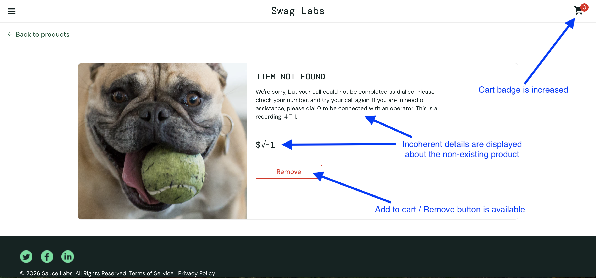

# BUG-004: Non-existent product can be added to the cart

## Summary

A non-existent product can be accessed by manually modifying the product ID in the URL. The application allows the invalid product to be added to the cart and displays inconsistent product information, resulting in an invalid application state.

## Environment

- Browser: Chrome 148
- OS: macOS
- User: `standard_user`

## Steps to Reproduce

1. Open the Sauce Demo site
2. Log in using valid credentials
3. Navigate to an invalid product URL (for example, https://www.saucedemo.com/inventory-item.html?id=7)
4. Click on the Add to cart button
5. Access to the cart

## Expected Results

The application should prevent interactions with non-existent products. Users should not be able to add an invalid product to the cart, and the application should remain in a consistent state.

## Actual Results

The application allows the invalid product to be added to the cart. The page displays inconsistent product information (placeholder image, invalid price, generic "Item Not Found" message, and a Add to cart / Remove button), the cart badge is incremented, and opening the cart results in an empty or unusable cart page.

## Business Impact

Although reproducing the issue requires manually modifying the URL, the application enters an inconsistent state by allowing a non-existent product to be added to the cart. This indicates insufficient validation of invalid resources and allows the application to enter an inconsistent state.

## Severity

Major

## Priority

Medium

## Evidence

Screenshot of the non-existing product page:

