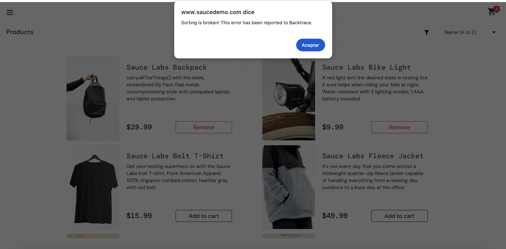

# BUG-005: Product sorting displays an internal error dialog for `error_user`

## Summary

Attempting to change the product sorting option while logged in as `error_user` causes an error dialog to be displayed. The dialog exposes an internal application message instead of handling the error gracefully, preventing the sorting operation from completing.

## Environment

- Browser: Chrome 148
- OS: macOS
- User: `error_user`

## Steps to Reproduce

1. Open the Sauce Demo site
2. Log in as `error_user`
3. Navigate to the Inventory page
4. Open the sort-by dropdown
5. Select any sorting option other than the default

## Expected Result

The selected sorting option should be applied and the product list should be reordered accordingly. If an unexpected error occurs, the application should display a user-friendly message without exposing internal implementation details.

## Actual Result

An error dialog is displayed containing the message:

```
"Sorting is broken! This error has been reported to Backtrace."
```

The sorting operation is not completed.

## Business Impact

Users are unable to sort the product catalog, negatively impacting product discoverability. Additionally, the application exposes internal implementation details ("Backtrace"), which may reduce user confidence and reveal unnecessary technical information.

## Severity

Major

## Priority

Medium

## Evidence


