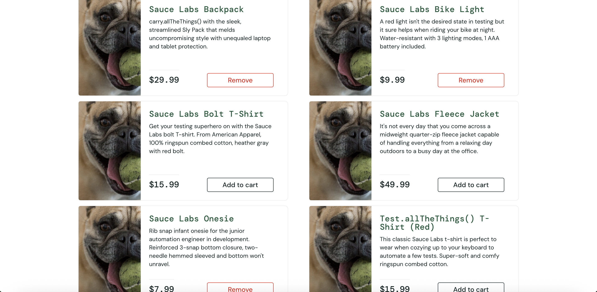

# BUG-009: Product images are incorrect for `problem_user`

## Summary

All products displayed on the Inventory page show the placeholder "not found" image when logged in as `problem_user`. The remaining product information (name, description and price) is displayed correctly.

## Environment

- Browser: Chrome 148
- OS: macOS
- User: `problem_user`

## Steps to Reproduce

1. Open the Sauce Demo site
2. Log in as `problem_user`
3. Observe the products displayed on the Inventory page.

## Expected Result

Each product should display its corresponding image.

## Actual Result

All products display the placeholder "not found" image instead of their corresponding product image.

## Business Impact

Product images are an important part of the shopping experience. Missing or incorrect images reduce product recognition and may negatively impact user confidence and purchasing decisions.

## Severity

Minor

## Priority

Medium

## Evidence

