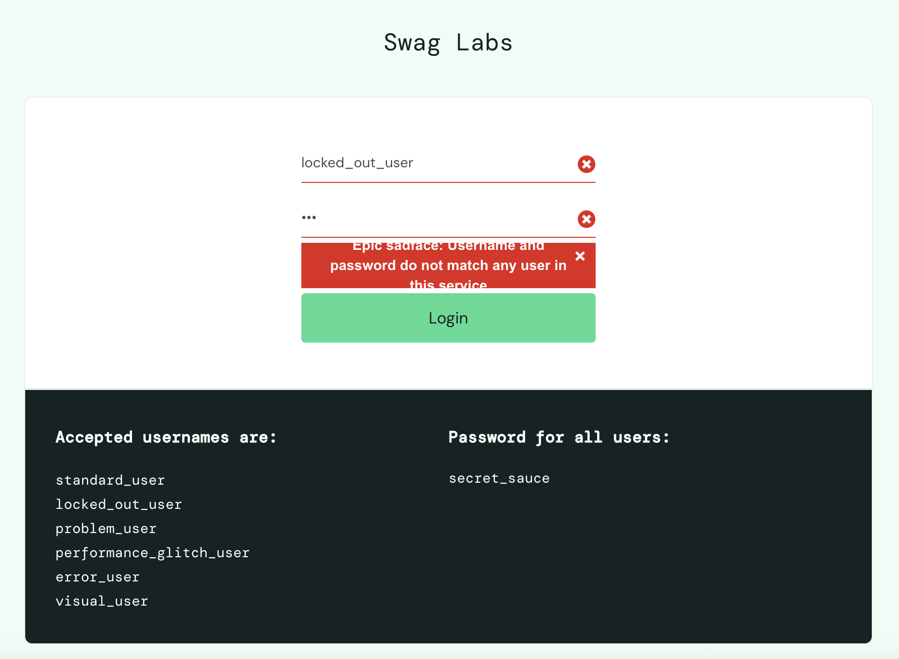

# BUG-010: Error message is truncated when displayed on the login page

## Summary

The login error message is displayed across three lines, but the notification container does not automatically adjust its height. As a result, part of the message is truncated and cannot be read.

## Environment

- Browser: Chrome 148
- OS: macOS
- User: `locked_out_user`

## Steps to Reproduce

1. Open the Sauce Demo site
2. Enter `locked_out_user` as the username
3. Enter an invalid password
4. Click on the Login button

## Expected Result

The entire error message should be fully visible regardless of its length. The notification container should automatically resize to accommodate the message.

## Actual Result

The error message takes three lines, but the notification container has insufficient height, causing the top and the bottom of the message to be truncated.

## Business Impact

Users cannot read the complete error message, making it harder to understand why the login failed. Although authentication is not affected, the issue negatively impacts usability and the overall user experience.

## Severity

Minor

## Priority

Low

## Evidence

